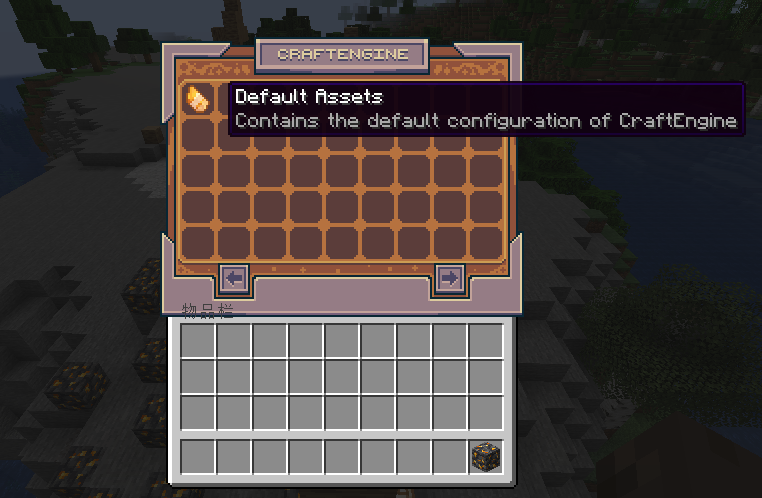
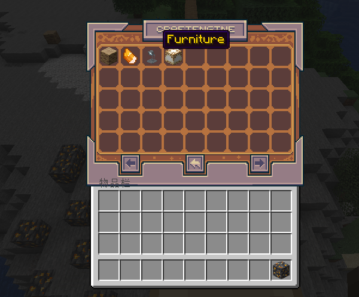
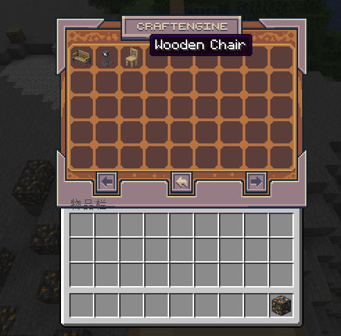

# 📂 分类系统  
本页主要说明如何在服务器中添加新的物品分类  

分类用于管理物品浏览界面中的物品排序规则与归类逻辑  

---

### 基础配置示例  
完成配置后，该分类将出现在 `/ce menu` 中：  
```yaml
categories:
  default:palm_tree:
    name: "<!i><green><i18n:category.palm_tree></green>"  # 分类名称（支持MiniMessage格式）
    lore: []  # 分类描述（悬浮文本）
    hidden: false  # 是否隐藏
    priority: 1  # 显示优先级
    icon: default:palm_log  # 分类图标（需配置对应物品）
    list:  # 包含内容
      - default:palm_sapling
      - default:palm_leaves
      - default:palm_log
      - default:stripped_palm_log
      - default:palm_wood
      - default:stripped_palm_wood
      - default:palm_planks
```

---

### 参数说明  
| 参数       | 功能说明                                                                 |
|------------|--------------------------------------------------------------------------|
| `name`     | 分类标题（支持多语言键`<i18n:>`和样式标签）                              |
| `lore`     | 分类描述（悬浮提示文本，支持多行）                                       |
| `hidden`   | 是否隐藏（设为`true`可实现嵌套分类）                                     |
| `priority` | 显示优先级（数值越小排序越靠前）                                         |
| `icon`     | 分类图标物品（需在插件中预先配置该物品）                                 |
| `list`     | 内容列表（可包含物品ID或子分类，子分类需以`#`前缀标识如`#default:wood`） |

---

### 嵌套分类配置  
当需要实现多级分类结构时（示例为二级嵌套）：  
```yaml
categories:
  # 主分类（可见）
  default:wood:
    name: "<green>木材系列</green>"
    icon: default:oak_log
    hidden: false
    priority: 1
    list:
      - "#default:palm_tree"  # 引用子分类
      - "#default:oak_tree"

  # 子分类（隐藏）
  default:palm_tree:
    name: "<!i><green>棕榈木系列</green>"
    hidden: true  # 隐藏于主菜单
    list:
      - default:palm_log
      - default:palm_planks
```  
```yaml
categories:
  default:default:
    priority: 1
    name: "<!i><white><i18n:category.default.name></white>"
    lore:
      - "<!i><gray><i18n:category.default.lore>"
    icon: default:topaz
    list:
      - "#default:palm_tree"
      - "#default:topaz"
      - "#default:furniture"
      - "#default:misc"
  default:palm_tree:
    name: "<!i><green><i18n:category.palm_tree></green>"
    hidden: true
    icon: default:palm_log
    list:
      - default:palm_sapling
      - default:palm_leaves
      - default:palm_log
      - default:stripped_palm_log
      - default:palm_wood
      - default:stripped_palm_wood
      - default:palm_planks
  default:topaz:
    name: "<!i><#FF8C00><i18n:category.topaz></#FF8C00>"
    hidden: true
    icon: default:topaz
    list:
      - default:topaz
      - default:topaz_ore
      - default:deepslate_topaz_ore
      - default:topaz_axe
      - default:topaz_pickaxe
      - default:topaz_hoe
      - default:topaz_shovel
      - default:topaz_sword
      - default:topaz_bow
      - default:topaz_crossbow
      - default:topaz_rod
  default:furniture:
    name: "<!i><#FFD700><i18n:category.furniture></#FFD700>"
    hidden: true
    icon: default:table_lamp
    list:
      - default:bench
      - default:table_lamp
      - default:wooden_chair
  default:misc:
    name: "<!i><gray><i18n:category.misc></gray>"
    hidden: true
    icon: default:chinese_lantern
    list:
      - default:chinese_lantern
      - default:fairy_flower
```  






### 📌 分类关联小技巧  
您可以直接在**物品配置内部**声明所属分类，但需注意：此方式无法保证物品在分类中的显示顺序  

#### 配置示例  
```yaml
items:
  default:topaz_sword:
    # 单分类声明（旧式）
    # category: default:topaz 
    
    # 多分类声明（推荐）
    category:
      - default:topaz  # 支持分类ID列表
      - default:gem_weapons
    
    # 物品基础属性  
    material: golden_sword
    custom-model-data: 1000
    data:
      display-name: "<!i><#FF8C00><i18n:item.topaz_sword>"
      tooltip-style: minecraft:topaz
      components:
        minecraft:max_damage: 64
    
    # 模型配置
    model:
      type: minecraft:model
      path: minecraft:item/custom/topaz_sword
      generation:
        parent: "minecraft:item/handheld"
        textures:
          "layer0": "minecraft:item/custom/topaz_sword"
```
