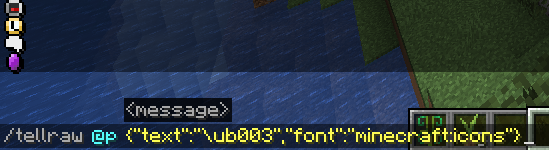

# 🖼️ 图像功能  
本页主要说明如何向服务器添加新图像  

若不了解位图原理请先阅读Minecraft Wiki  
https://minecraft.wiki/w/Font#Bitmap_provider  

**核心原理** 
Minecraft的"图像显示"本质是巧妙的字符替换机制：游戏通过字体系统将特定Unicode字符映射到图像文件进行渲染  

**字体生态要素** 

**多字体集支持** 
原生支持多种字体（如minecraft:default、minecraft:uniform）并可扩展修改  

**自定义字体创建**
通过定义以下结构创建个性化字体：  
```  
assets/[命名空间]/font/[字体名称].json  
```  
- 命名空间：唯一标识符（如my_namespace）  
- 字体名称：自定义字体标识（如magic_symbols）  

**调用格式**
- MiniMessage: `<font:命名空间:字体名称>文字</font>`  
- MineDown: `[文字](font=命名空间:字体名称)`  

**工作机制**
当使用\uXXXX Unicode转义序列时：  
1. 游戏检测文本组件使用的字体  
2. 将字符映射到对应纹理  
3. 在指定字符位置渲染纹理  

----------------------------------------

**常见疑问**
Q：会影响到本国文字显示吗？  
Q：玩家能否通过聊天/铁砧等途径非法使用这些图像？  
----------------------------------------
A：绝对不受影响（除非使用minecraft:default字体）。请避免使用minecraft:default字体，此属非受支持行为  

----------------------------------------

**单字符位图配置**
```yaml
images:
  internal:item_browser:
    height: 140    # 总高度（像素）
    ascent: 18     # 基线以上高度（像素）
    font: minecraft:internal  # 使用的字体集
    file: minecraft:font/gui/custom/item_browser.png  # 图像路径
    char: '\ub000'  # 映射的Unicode字符
```
⚠️ **强制规则**  
`height` 值必须 ≥ `ascent` 值（由Minecraft严格校验）  

---

**多字符位图配置**
```yaml
images:
  default:icons:
    height: 10
    ascent: 9
    font: minecraft:icons
    file: minecraft:font/image/icons.png
    chars:  # 多字符映射组
     - '\ub000\ub001'  # 连续字符范围
     - '\ub002\ub003'
```

---

**扩展应用指南**
- 结合PlaceholderAPI使用 → 参见 🅿️ [PlaceholderAPI页面](...)  
- 在CraftEngine插件中使用 → 参见 ✏️ [文本格式化文档](...)  

---

*游戏内预览*
执行简单命令即可预览（将 `\ub000` 替换为你的映射字符）：  



```mcfunction
/tellraw @p {"text":"\ub000","font":"minecraft:icons"}
```


**与其他插件的兼容性**
可通过以下两种方式在其他插件中使用图像功能：  

#### 方式一：通过MiniMessage/MineDown与PlaceholderAPI  
若插件支持 **MiniMessage/MineDown** 和 **PlaceholderAPI**，直接调用对应占位符即可。具体用法请参阅：  
🅿️ [PlaceholderAPI使用指南](...)  

#### 方式二：通过CraftEngine专用标签  
使用与 ✏️ [文本格式化](...) 相同的标签语法：  
- `<image:命名空间:id>`  
- `<image:命名空间:id:行:列>`  
- `<shift:-20>`（偏移调整）  

CraftEngine会在**数据包层面**自动将这些标签替换为对应字体字符。  

---

**数据包拦截配置** 
在 `config.yml` 中可控制标签生效范围：  
```yaml
image:
  # 通过拦截数据包，允许在其他插件中使用<image...>和<shift...>标签  
  intercept-packets:
    system-chat: true     # 系统聊天栏
    tab-list: true       # 玩家列表
    actionbar: true      # 动作栏
    title: true          # 标题/副标题
    bossbar: true        # Boss血条
    container: true      # 容器界面
    team: true           # 队伍名称
    scoreboard: true     # 记分板
    entity-name: false   # 实体名称（默认关闭）
    text-display: true   # 文字展示实体
```  
> 注：关闭 `entity-name` 可避免生物名称因特殊字符显示异常