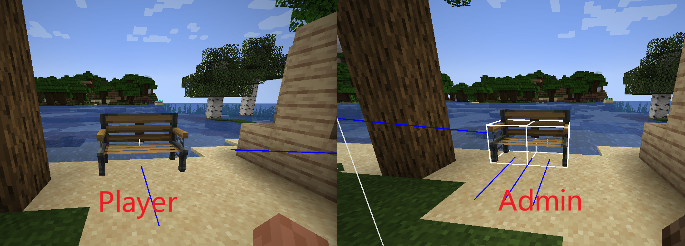

⚙️ 家具设置

item
指定该家具对应的物品标识。通常用于在创造模式中通过中键点击获取家具物品（1.21.4+版本支持）。

```yaml
item: default:test_furniture
```

sounds
配置家具在不同情境下的音效：
- break：玩家破坏家具时的音效
- place：玩家放置家具时的音效

基础配置：
```yaml
sounds:
  break: minecraft:block.bamboo_wood.break
  place: minecraft:block.bamboo_wood.place
```

高级配置（精确控制音调与音量）：
```yaml
sounds:
  break:
    id: minecraft:block.deepslate.break  # 音效ID
    pitch: 0.5  # 音调（0.5-2.0）
    volume: 0.25  # 音量（0.0-1.0）
  place: minecraft:block.deepslate.step
```

minimized
是否对无管理员权限的玩家启用网络数据包优化（减少传输数据量）。

```yaml
minimized: true
```
