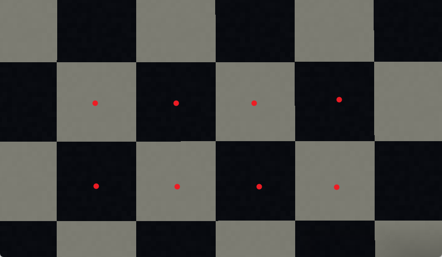
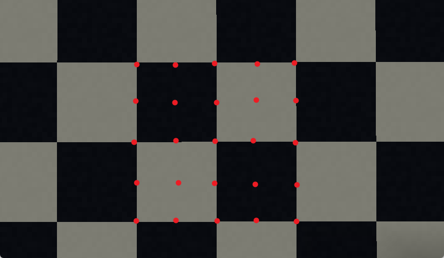
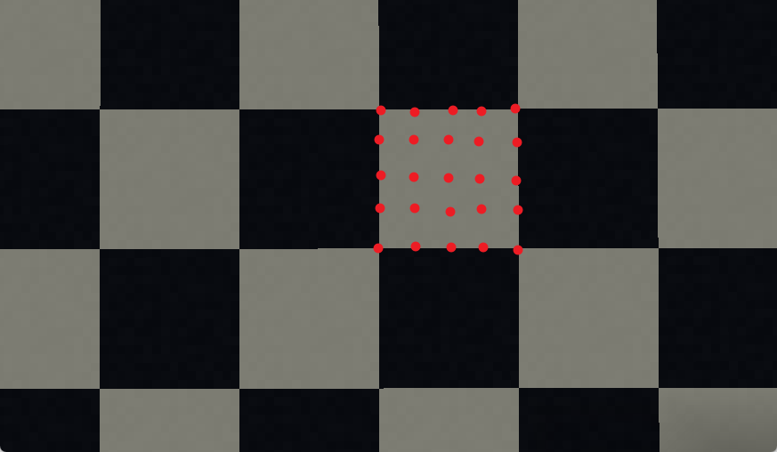
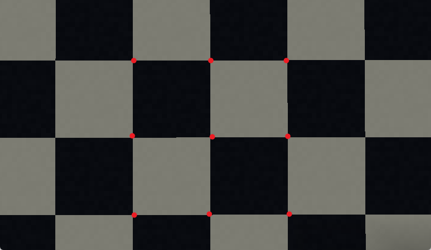
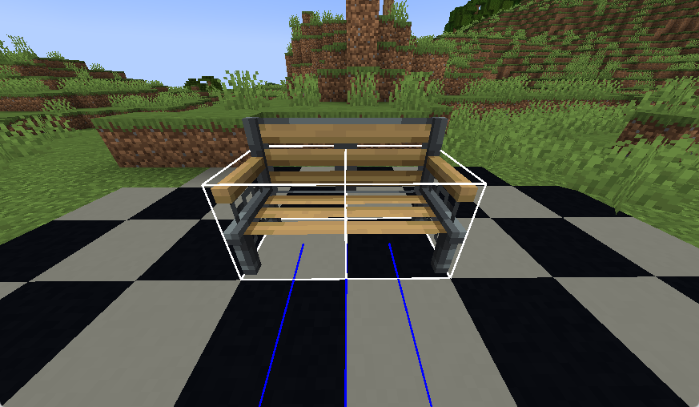

### 📍 家具放置方式  
**引言**  
家具支持三种放置模式：地面、天花板和墙面。针对不同放置模式，可采用差异化的外观与碰撞箱方案。例如，一盆绿植家具在地面放置时可直立摆放，悬挂于天花板时可呈现绳索垂吊形态，而墙面安装时则可通过木板支架固定——这与原版钟块的特性类似。  

单件家具可同时配置多种放置模式。  

下文将以地面模式为例，讲解基础放置配置方法。  
```yaml
furniture:
  default:bench:  # 家具ID
    placement:
      ground:  # 地面放置配置
        # 支持外部模型 (需取消注释使用)
        # model-engine: blueprint_id  # ModelEngine模型ID
        # better-model: blueprint_id  # BetterModel模型ID
        
        rules:  # 放置规则
          rotation: EIGHT  # 旋转精度: ANY(任意)/FOUR(4向)/EIGHT(8向)/SIXTEEN(16向)/固定方向
          alignment: CENTER  # 对齐方式: ANY(任意)/CENTER(中心)/HALF(半格)/QUARTER(1/4格)/CORNER(角落)
        
        elements:  # 外观组件
          - item: default:bench  # 使用的物品ID
            display-transform: NONE  # 显示变换: NONE(无)/各种手持/头部/GUI等显示模式
            billboard: FIXED  # 广告牌模式: FIXED(固定)/VERTICAL(垂直)/HORIZONTAL(水平)/CENTER(中心)
            position: 0.5,0,0  # 实体位置偏移 (X,Y,Z)
            translation: 0,0.5,0  # 模型渲染偏移 (X,Y,Z)
        
        hitboxes:  # 碰撞箱设置
          - type: interaction  # 交互型碰撞箱 (无物理碰撞)
            can-use-item-on: false  # 是否允许使用物品交互 (默认false)
            can-be-hit-by-projectile: false  # 是否可被抛射物击中 (默认false)
            blocks-building: false  # 是否阻挡建筑放置 (默认true)
            position: 0,0,0  # 碰撞箱位置
            width: 1  # 宽度
            height: 2  # 高度
            # 可用scale简写代替width/height:
            # scale: 1,2 
            interactive: true  # 是否可交互 (默认true)
            seats:  # 座位设置
              - 0,0,-0.1 0  # 座位坐标+朝向 (X,Y,Z 角度)
          
          - type: shulker  # 潜影盒型碰撞箱 (硬碰撞)
            can-use-item-on: true  # 默认true
            can-be-hit-by-projectile: true  # 默认true
            blocks-building: true  # 默认true
            position: 1,0,0  # 位置
            scale: 1  # 缩放 (1.20.5+)
            peek: 0  # 开启高度 (0-100)
            direction: UP  # 方向: UP(上)/DOWN(下)/NORTH(北)/EAST(东)/SOUTH(南)/WEST(西)
            interaction-entity: true  # 是否生成独立交互实体
            interactive: true  # 是否可交互
            seats:
              - 1,0,-0.1 0  # 座位设置
          
          - type: custom  # 自定义型碰撞箱 (软碰撞)
            position: 1,0,0  # 位置
            scale: 5  # 缩放 (1.20.5+)
            entity-type: slime  # 使用的实体类型 (默认史莱姆)
```

共有三个部分：`规则`、`元素`和`碰撞体`。

`规则`部分决定了家具摆放后的位置与旋转约束。
`元素`部分定义了组成家具的部件（可为单件家具配置多个部件，每个部件可设置不同显示模式）。  
`碰撞体`部分则用于设定家具的碰撞体积。

## 规则  
# 旋转  

本插件家具支持多种旋转方案，其差异在于对旋转角度的数量限制或直接指定旋转方向。  
旋转对壁挂式摆放方式无效。  

# 对齐方式


center


half


quarter


corner

对齐设置同样适用于壁挂式家具的摆放。

## 元素  
`元素`是构成家具外观的各个组成部分。大多数家具只需单个元素即可。如需制作更复杂的家具，可通过多个元素组合实现。例如全息投影可分为底座和投影两个元素：底座可固定朝向，而投影可设置为始终朝向玩家。

```yaml
elements:
  - item: default:bench
    display-transform: NONE # 可选值：NONE/THIRD_PERSON_LEFT_HAND/THIRD_PERSON_RIGHT_HAND
                            # FIRST_PERSON_LEFT_HAND/FIRST_PERSON_RIGHT_HAND
                            # HEAD/GUI/GROUND/FIXED
    billboard: FIXED  # 可选值：FIXED/VERTICAL/HORIZONTAL/CENTER
    position: 0.5,0,0
    translation: 0,0.5,0
    scale: 1,1,1
```

需注意`position`与`translation`的区别：`position`用于调整显示实体的坐标位置，而`translation`是显示实体自身的位移属性。

对于壁挂式家具，必须使用`position`进行微调偏移，否则在某些视角下家具可能显示为黑色，这与Minecraft的实体渲染机制有关。

## 碰撞箱  
`碰撞箱`是发送给玩家的交互实体，可通过F3+B调试界面查看其效果。



```yaml
hitboxes:
  - position: 0,0,0
    width: 1
    height: 1
    interactive: true
    seats:
      - 0,0,-0.1 0
  - position: 1,0,0
    width: 1
    height: 1
    interactive: true
    seats:
      - 1,0,-0.1 0
```
单个碰撞箱可配置多个座位。若多个碰撞箱的座位坐标重合，实际仅会生成一个座位。

座位位置由坐标+旋转角度定义（配置中用空格分隔）：
```yaml
0,0,0 0
```
也可不配置旋转角度，允许玩家入座后自由调整朝向：
```yaml
0,0,0
```
### **外部模型**  
你可以使用 **ModelEngine** 或 **BetterModel** 的外部模型来制作家具。  


0,0,0,0


0,0,0

```yaml
furniture:  
  default:bench:  
    placement:  
      ground:  
        model-engine: blueprint_id  # 使用 ModelEngine 的模型蓝图ID  
        better-model: blueprint_id # 使用 BetterModel 的模型蓝图ID  
        rules:  
          # 旋转规则：ANY（任意） / FOUR（4方向） / EIGHT（8方向） / SIXTEEN（16方向）  
          # 或固定朝向：NORTH（北） / EAST（东） / WEST（西） / SOUTH（南）  
          rotation: EIGHT  
          
          # 对齐方式：ANY（任意） / CENTER（中心对齐） / HALF（半格对齐）  
          # QUARTER（1/4格对齐） / CORNER（角落对齐）  
          alignment: CENTER  
```  