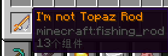
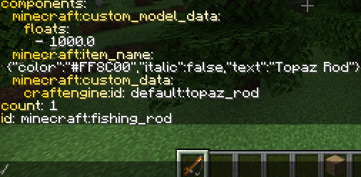

# 🔢 客户端绑定物品数据  
"客户端绑定数据"仅存在于客户端，服务端无相关组件。此功能需安装craftengine-ignite-mod方可实现。

🔢物品数据中的所有配置选项均适用于🔢客户端绑定物品数据。

```yaml
items:
  default:topaz_rod:
    client-bound-data:
      item-name: "<!i><#FF8C00>我并非黄玉杖"
    data:
      item-name: "<!i><#FF8C00>黄玉杖"
```



客户端绑定数据对冒险模式玩家非常实用，可使其破坏服务端特定的真实自定义方块。

```yaml
items:
  default:topaz_pickaxe:
    material: golden_pickaxe
    custom-model-data: 1000
    settings:
      tags:
        - "default:topaz_tools"
    client-bound-data:
      components:
        # 客户端方块状态
        can_break:
          blocks: minecraft:note_block
          state:
            "instrument": "hat"
            "note": "0"
            "powered": "false"
    data:
      item-name: "<!i><#FF8C00><i18n:item.topaz_pickaxe>"
      tooltip-style: minecraft:topaz
      components:
        minecraft:max_damage: 64
        # 服务端方块状态
        can_break:
          blocks: "craftengine:note_block_1"
    model:
      template: default:model/simplified_handheld
      arguments:
        path: "minecraft:item/custom/topaz_pickaxe"
```
