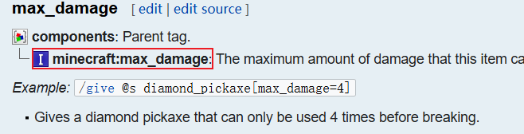
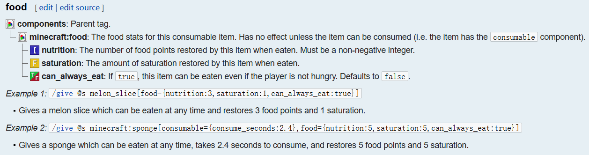
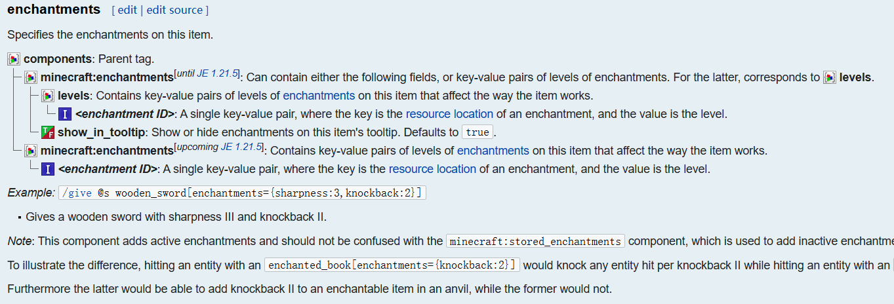

# 🔢 物品数据  
为物品设置原版NBT/组件数据以调用原生Minecraft功能  

### 什么是物品数据？  
物品数据指旧版本中的物品NBT（命名二进制标签），或1.20.5及以上版本的物品组件数据。通过这些数据，我们可以自定义物品的名称、描述、属性和其他功能。  

### 外部数据  
若需让CraftEngine物品继承外部插件物品的数据，请按如下配置：  

```yaml
items:
  default:example_item:
    data:
      external:
        plugin: NeigeItems
        id: example_item
```

🐌 支持的外部物品数据提供方  

### 硬编码数据  
硬编码数据指由插件提供和维护的配置格式，能确保多版本兼容性。这些格式由插件定义，可能与游戏原生的NBT或组件格式不同。其优势在于插件会处理所有维护工作（包括版本适配），用户无需关注游戏版本更新带来的变更。  

```yaml
items:
  default:topaz_rod:
    data:
      item-name: "<!i><#FF8C00>黄水晶法杖"
```  
### 物品名称（item-name）  
定义该物品的默认名称。与自定义名称（custom-name）不同，此名称：  
- 无法通过铁砧抹除  
- 不会自动变为斜体  
- 在某些界面（如旗帜图案、物品展示框）中不会显示  

```yaml
items:
  default:topaz_rod:
    data:
      item-name: "<!i><#FF8C00>黄水晶法杖" # 此处使用<!i>是因为1.20.4及以下版本
                                          # 不支持item_name组件
```

### 自定义名称（custom-name）  
用于像铁砧命名一样设置物品的显示名称  

```yaml
items:
  default:topaz_rod:
    data:
      custom-name: "<!i><#FF8C00>黄水晶法杖"
```

### 描述文本（lore）  
定义物品的悬浮描述内容  

```yaml
items:
  default:topaz_rod:
    data:
      lore: 
        - "多么闪亮的法杖！"
```

### 不可破坏（unbreakable）  
设定物品是否永不损毁  

```yaml
items:
  default:topaz_rod:
    data:
      unbreakable: true
```

### 附魔效果（enchantment）  
为物品添加附魔  

```yaml
items:
  default:topaz_rod:
    data:
      enchantment:
        minecraft:sharpness: 1
        custom:enchant: 3
```

### 唱片机可播放（jukebox-playable，1.21+）  
```yaml
items:
  default:music_stick:
    material: stick
    data:
      jukebox-playable: default:credits_music
```

### 工具提示样式（tooltip-style，1.21.2+）  
设定物品悬浮提示框的样式  

```yaml
items:
  default:topaz_rod:
    data:
      tooltip-style: minecraft:topaz #命名空间:提示样式ID
```  


-----------------------------------------  
您需要将纹理文件放置在以下目录中：  
[数据组件格式/工具提示样式参考](https://minecraft.wiki/w/Data_component_format/tooltip_style)  

-------------------------------------------


### 盔甲纹饰（trim）  
为[工具](https://minecraft.wiki/w/Tool)或[盔甲](https://minecraft.wiki/w/Armor)添加装饰性纹样  

```yaml
trim:
  pattern: eye # 纹饰图案类型参考[锻造台#纹饰](https://minecraft.wiki/w/Smithing#Trimming)
  material: iron # 纹饰材料参考[锻造台#材料](https://minecraft.wiki/w/Smithing#Material)
```

### 可装备物品（equippable，1.21.2+）  
配置此项后，物品可装备至指定槽位  

```yaml
equippable:
  # 装备槽位类型
  slot: head # 可选值：HEAD（头部）/ CHEST（胸部）/ LEGS（腿部）/ FEET（脚部）/ BODY（身体）/ MAIN_HAND（主手）/ OFF_HAND（副手）/ SADDLE（鞍具）
  
  # 可选参数
  asset-id: minecraft:topaz # 装备资源标识，对应路径为assets/<命名空间>/equipment/<id>.json
  camera-overlay: namespace:id # 装备时的镜头遮罩纹理路径，对应assets/<命名空间>/textures/<id>
  dispensable: true # 是否可通过发射器装备
  damage-on-hurt: true # 穿戴者受伤时物品是否同步损耗耐久
  swappable: true # 是否支持右键快速装备
  # >=1.21.5新增
  equip-on-interact: true # 是否允许对生物按使用键直接装备
```

### 自定义数据配置  
⚠️ 注意：此类数据不由插件维护，其格式可能随Minecraft版本更新而改变（尤其是组件系统近期频繁变动）。为避免因版本升级导致大规模配置重构，建议：  
1. 使用模板建立标准化配置格式  
2. 新版本发布时仅需更新模板即可适配变更  
📌 模板使用教程请务必阅读：[模板指南](add_new_content/templates.md)  

### NBT格式（1.20-1.20.4）  
NBT（命名二进制标签）已过时，此处不再赘述  
[1.20.5之前物品格式参考](https://minecraft.wiki/w/Item_format/Before_1.20.5)  

```yaml
items:
  default:topaz_rod:
    data:
      nbt:
        CustomModelData: 1000 # 自定义模型数据
```

### 组件格式（1.20.5+）  
自定义组件配置严格遵循[Minecraft Wiki规范](https://minecraft.wiki/w/Data_component_format)，以下是典型示例：  


从图示中可以明确看出，max_damage参数接受I类型（即整型参数）的输入。因此在实际配置时，我们直接使用数值即可完成设定：

```yaml
items:
  guide:test:
    data:
      components:
        minecraft:max_damage: 128
```


如图所示，食物组件需要配置三个参数：
- `nutrition`（营养值）：整型(int)
- `saturation`（饱和度）：浮点型(float)  
- `can_always_eat`（随时可食用）：布尔型(boolean)

配置示例：
```yaml
items:
  guide:test:
    data:
      components:
        minecraft:food:
          nutrition: 4    # 饥饿值恢复量
          saturation: 2.0 # 饱和度恢复量 
          can_always_eat: false # 是否无视饱食度限制
```


现在我们来学习复合标签（compound tag）的配置方法。在YAML中，`{}`符号表示需要开启一个新的配置段落：

```yaml
items:
  guide:test:
    data:
      components:
        minecraft:enchantments:
          levels:
            minecraft:sharpness: 1
          show_in_tooltip: false
```

但请注意，根据Wiki最新说明，此配置方式将在1.21.5版本废弃。升级到1.21.5后，您需要调整为：

```yaml
items:
  guide:test:
    data:
      components:
        minecraft:enchantments:
          minecraft:sharpness: 1
```

组件也支持JSON格式配置：
```yaml
minecraft:custom_data: "(json) {\"test\":1}"
```

以下是版本变更导致的组件配置演变示例：
```yaml
items:
  default:topaz_rod:
    data:
      components:
        # 1.20.5-1.21.3
        minecraft:custom_model_data: 1000
        # 1.20.5-1.21.4
        minecraft:enchantments:
          levels:
            minecraft:sharpness: 1
          show_in_tooltip: false
          
        # 1.21.4+
        minecraft:custom_model_data:
          floats:
            - 1000.0
        # 1.21.5+
        minecraft:enchantments:
          minecraft:sharpness: 1
```

为避免版本更新带来的配置维护问题，建议使用模板方案：

```yaml
templates:
  # 适用于1.20.5-1.21.3
  components:custom_model_data:
    minecraft:custom_model_data: "{cmd}"
  # 适用于1.20.5-1.21.4  
  components:enchantments:
    minecraft:enchantments:
      levels: "{enchantments}"
      show_in_tooltip: false

# 1.21.4+版本模板更新
templates:
  components:custom_model_data:
    minecraft:custom_model_data:
      floats:
        - "{cmd}"

# 1.21.5+版本模板更新
templates:
  components:enchantments:
    minecraft:enchantments: "{enchantments}"
    minecraft:tooltip_display:
      hidden_components:
        - minecraft:enchantments

# 实际物品配置（无需随版本修改）
items:
  test:item:
    data:
      components:
        template: 
          - components:custom_model_data
          - components:enchantments
        arguments:
          cmd: 1000
          enchantments:
            minecraft:sharpness: 1
```

（注：通过模板系统实现版本隔离，只需维护模板文件即可实现全量配置升级）