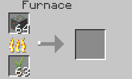
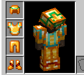
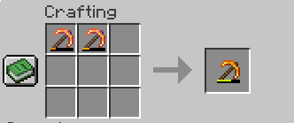

# ⚙️ 物品设置  
与数据不同，设置项中的内容涉及插件处理的特殊机制。  

**燃料时间**  
决定物品可燃烧的游戏刻数  

```yaml
fuel-time: 100
```  



**标签**  
详见 [📖 合成配方](add_new_content/recipe.md)

```yaml
tags:
  - "default:palm_logs"
  - "minecraft:logs"
  - "minecraft:logs_that_burn"
```  

**可装备性 (1.21.2+)**  
请注意，🔢 物品数据中的 `equippable` 与 ⚙️ 物品设置中的 `equippable` 并不相同。设置中的可装备性功能会自动为用户生成相关JSON文件，且支持更广泛的版本；而数据中的可装备性要求用户手动在资源包内创建JSON文件，仅支持1.21.2及以上版本。  

开发者将永不支持通过皮革结合着色器制作自定义盔甲的方法。使用核心着色器通常会导致与客户端着色器的兼容性较差。此外，Minecraft开发者认为这种方式不够稳定可靠，我们应尽量避免过度使用核心着色器。  

```yaml
equippable:
  # 必填参数
  # 物品可装备的槽位
  slot: head # 可选值：HEAD（头部）/ CHEST（胸部）/ LEGS（腿部）/ FEET（脚部）/ BODY（身体）/ MAIN_HAND（主手）/ OFF_HAND（副手）/ SADDLE（鞍具）
  
  # 该路径指向 assets/<命名空间>/equipment/<id>.json
  asset-id: topaz
  # 实际使用时只需从下列选项中选择需要的配置即可。
  # 注意：当多个物品共用相同asset-id时，必须确保它们的贴图路径一致，
  # 否则可能导致其中一个物品显示错误。
  humanoid: "minecraft:topaz"          # 人形生物模型
  humanoid-leggings: "minecraft:topaz" # 人形生物护腿模型
  llama-body: "minecraft:topaz"        # 羊驼身体模型
  horse-body: "minecraft:topaz"        # 马身体模型
  wolf-body: "minecraft:topaz"         # 狼身体模型
  wings: "minecraft:topaz"             # 翅膀模型
  
  # 可选参数
  camera-overlay: "namespace:id"       # 装备时的第一人称视角遮罩贴图路径（位于assets/<命名空间>/textures/<id>）
  dispensable: true                    # 是否可通过发射器装备
  damage-on-hurt: true                 # 穿戴者受伤时该物品是否同步损耗耐久
  swappable: true                      # 是否可通过右键点击直接装备到对应槽位
  # >= 1.21.5 版本参数
  equip-on-interact: true              # 是否可对目标生物按使用键直接装备（只要该物品能装备到目标生物上）
```



可修复性:
决定物品是否可通过工作台/铁砧修复（默认值：true）

```yaml
repairable: true
```



铁砧修复材料:
定义修复时提供的耐久度数值

```yaml
anvil-repair-item:
  - target: "#topaz_tools"    # 目标物品标签
    amount: 20                # 固定恢复20点耐久
  - target:                   # 目标物品列表
      - "minecraft:iron_pickaxe"
      - "minecraft:shears"
    percent: 0.25             # 恢复25%总耐久度
```

可重命名性:
决定物品是否能在铁砧中重命名（默认值：true）

```yaml
renameable: false
```
