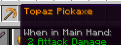

# 🟰 物品模型  
本页主要说明如何为物品配置模型。

自1.21.4版本起，Minecraft开始支持更复杂的物品模型系统，使您能够为物品创建动态变体。本教程专为1.21.4及以上版本编写。对于旧版本，插件会自动降级模型文件（注意：无法100%兼容旧版，因为许多条件和模型类型在旧版中不存在）。

如果您发现CraftEngine缺少最新Minecraft版本中的某些特性，可以在GitHub提交issue向开发团队反馈。

## 介绍
以最简单的`minecraft:model` 📐 模型类型为例：

```yaml
items:
  default:topaz_pickaxe:
    model:
      type: minecraft:model  # 模型类型声明
      path: minecraft:item/custom/topaz_pickaxe  # 模型路径
      generation:
        parent: "minecraft:item/handheld"  # 继承手持物品父模型
        textures:
          "layer0": "minecraft:item/custom/topaz_pickaxe"  # 基础纹理
```

若未指定类型，默认会使用`minecraft:model`。因此上述配置等价于：

```yaml
items:
  default:topaz_pickaxe:
    model:
      path: minecraft:item/custom/topaz_pickaxe
      generation:
        parent: "minecraft:item/handheld"
        textures:
          "layer0": "minecraft:item/custom/topaz_pickaxe"
```

若不清楚如何处理模型生成`generation`和路径`path`配置，请阅读 [🏭️ 模型生成](add_new_content/model.md) 章节。


从配置可见，在`model`节点下需要声明模型类型及对应参数。以下是所有可用模型类型的索引（部分模型如范围分发、选择器、复合模型和条件模型支持嵌套使用）。阅读完各类型说明后，我们将深入讨论更复杂的案例：

### **[📐 模型组合范例](item/model_model.md)**
### **[🧩 复合模型](item/composite.md)**
### **[⚖️ 条件判断](item/condition.md)**
### **[📡 范围调度](item/range_Dispatch.md)**
### **[✅ 选择器](item/select.md)**

以下示例通过`condition`、`range_dispatch`和`select`模型的组合，创建了一个自动生成2D弩箭的模板：

```yaml
templates:
  models:crossbow_2d:
    type: "minecraft:condition"  # 条件判断模型
    property: "minecraft:using_item"  # 检测物品使用状态
    on-false:  # 未使用时模型分支
      type: "minecraft:select"  # 选择器模型
      property: "minecraft:charge_type"  # 根据装填类型选择
      cases:
        - when: arrow  # 装填箭矢时
          model:
            type: minecraft:model
            path: "{crossbow_arrow_model}"
            generation:
              parent: "minecraft:item/crossbow_arrow"  # 箭矢弩基础模型
              textures:
                "layer0": "{crossbow_arrow_texture}"
        - when: rocket  # 装填烟花火箭时
          model:
            type: minecraft:model
            path: "{crossbow_firework_model}"
            generation:
              parent: "minecraft:item/crossbow_firework"  # 烟花弩基础模型
              textures:
                "layer0": "{crossbow_firework_texture}"
      fallback:  # 默认状态（未装填）
        type: minecraft:model
        path: "{crossbow_model}"
        generation:
          parent: "minecraft:item/crossbow"  # 普通弩模型
          textures:
            "layer0": "{crossbow_texture}"
    on-true:  # 使用时模型分支（拉弦状态）
      type: "minecraft:range_dispatch"  # 范围分发模型
      property: "minecraft:crossbow/pull"  # 根据拉弦进度切换
      entries:
        - model:  # 拉弦阶段1（进度≥58%）
            type: minecraft:model
            path: "{crossbow_pulling_1_model}"
            generation:
              parent: "minecraft:item/crossbow_pulling_1"
              textures:
                "layer0": "{crossbow_pulling_1_texture}"
          threshold: 0.58  # 触发阈值
        - model:  # 拉弦阶段2（进度100%）
            type: minecraft:model
            path: "{crossbow_pulling_2_model}"
            generation:
              parent: "minecraft:item/crossbow_pulling_2"
              textures:
                "layer0": "{crossbow_pulling_2_texture}"
          threshold: 1.0
      fallback:  # 拉弦初始状态（进度<58%）
        type: minecraft:model
        path: "{crossbow_pulling_0_model}"
        generation:
          parent: "minecraft:item/crossbow_pulling_0"
          textures:
            "layer0": "{crossbow_pulling_0_texture}"
```
